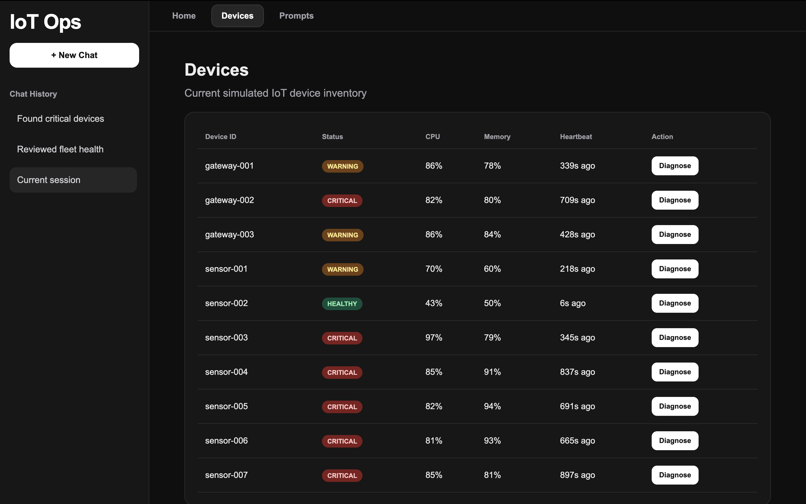
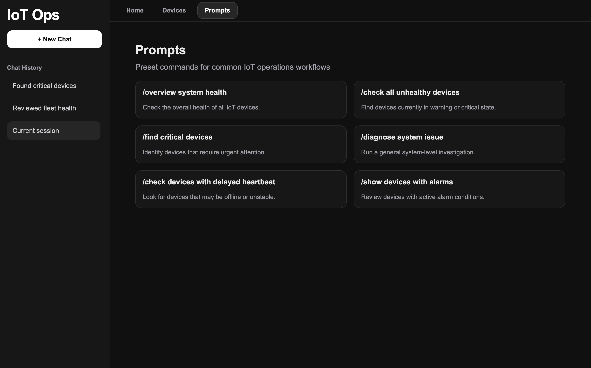

# IoT Ops AI Agent

AI-powered IoT operations monitoring platform with multi-step reasoning agents, real-time telemetry simulation, and fleet-level diagnostics.

---

## Overview

IoT Ops AI Agent is a simulated observability platform designed to monitor and diagnose IoT infrastructure using LLM-powered agents.

The project demonstrates the evolution from:

- **IOAA v1** → single-step tool calling assistant
- **IOAA v2** → multi-step reasoning agent with iterative diagnostics

The platform includes:

- Real-time telemetry simulation
- SQLite-backed device monitoring
- Fleet-wide health analysis
- Streaming reasoning traces
- AI-assisted diagnostics
- Web dashboard interface

---

## Features

### IOAA v1 — Single-Step Tool Calling
- Basic LLM tool invocation
- One-shot device diagnostics
- Simple operational assistant

### IOAA v2 — Multi-Step Reasoning Agent
- ReAct-style reasoning loop
- Multi-step investigations
- System-wide diagnostics
- Fleet-level alarm analysis
- Real-time reasoning trace streaming

### Real-Time Telemetry Simulation
- 10 simulated IoT devices
- Periodic telemetry updates
- Dynamic device health states
- CPU / memory / heartbeat monitoring

### Dashboard UI
- ChatGPT-inspired interface
- Devices tab
- Prompt library
- Chat history sidebar
- Real-time device refresh
- Streaming reasoning visualization

---

## Architecture

```text
Virtual Devices
        ↓
Telemetry Simulator
        ↓
SQLite Database
        ↓
Flask Backend
        ↓
AI Agent Layer
        ↓
Dashboard UI
```

---

## Tech Stack

- Python
- Flask
- SQLite
- OpenAI API
- HTML / CSS / Vanilla JavaScript

---

## Example Workflow

### Fleet-Level Diagnosis

```text
User:
"overview system health"

Agent:
1. check_system_overview
2. check_system_alarms
3. Generate final diagnosis
```

### Device-Level Investigation

```text
User:
"diagnose gateway-003"

Agent:
1. check_device_status
2. get_recent_logs
3. check_alarm_rules
4. Generate final diagnosis
```

---

## Project Structure

```text
iot-ops-agent/
│
├── app.py
├── simulator.py
├── database.py
├── telemetry.db
│
├── agents/
│   ├── week1_agent.py
│   └── week2_agent.py
│
├── templates/
│   └── index.html
│
├── static/
│   ├── style.css
│   └── script.js
│
├── tools.py
├── prompts.py
└── README.md
```

---

## Installation

### Clone repository

```bash
git clone https://github.com/giangng611/iot-ops-agent.git
cd iot-ops-agent
```

### Install dependencies

```bash
pip install -r requirements.txt
```

### Initialize database

```bash
python3 init_db.py
```

### Start telemetry simulator

```bash
python3 simulator.py
```

### Start Flask application

```bash
python3 app.py
```

Open:

```text
http://127.0.0.1:5000
```

---

## Screenshots

### Dashboard


---

### Devices Tab



---

### Prompts Tab



---

## Future Improvements

- Supabase / PostgreSQL integration
- Real IoT telemetry ingestion
- WebSocket live updates
- Authentication
- Historical analytics
- AI anomaly prediction
- Production deployment

---

## Author

Giang Nguyen Do 
Computer Science @ University of Georgia