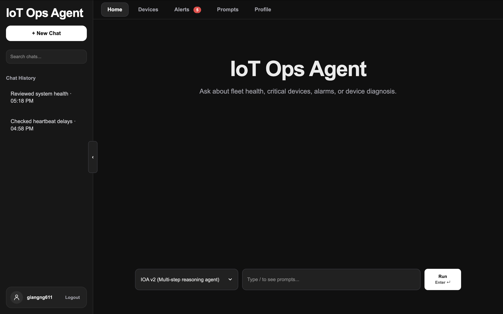
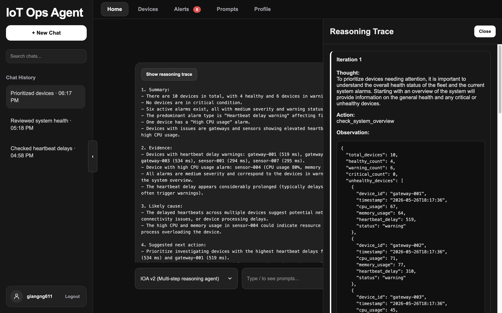
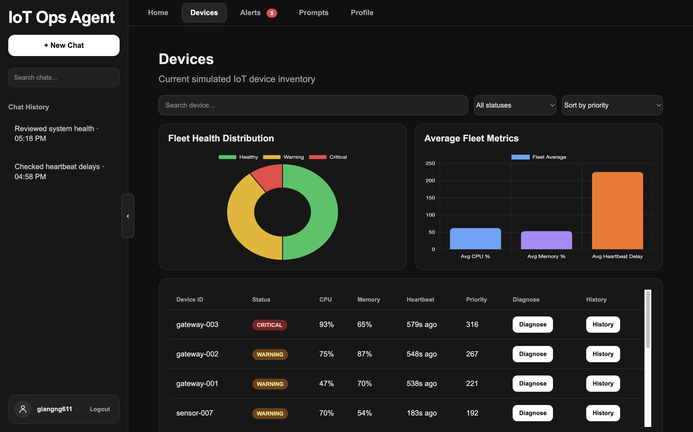
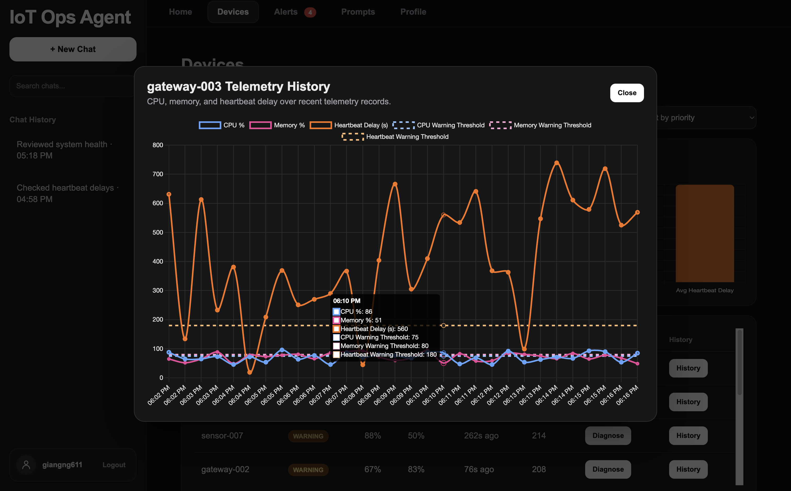
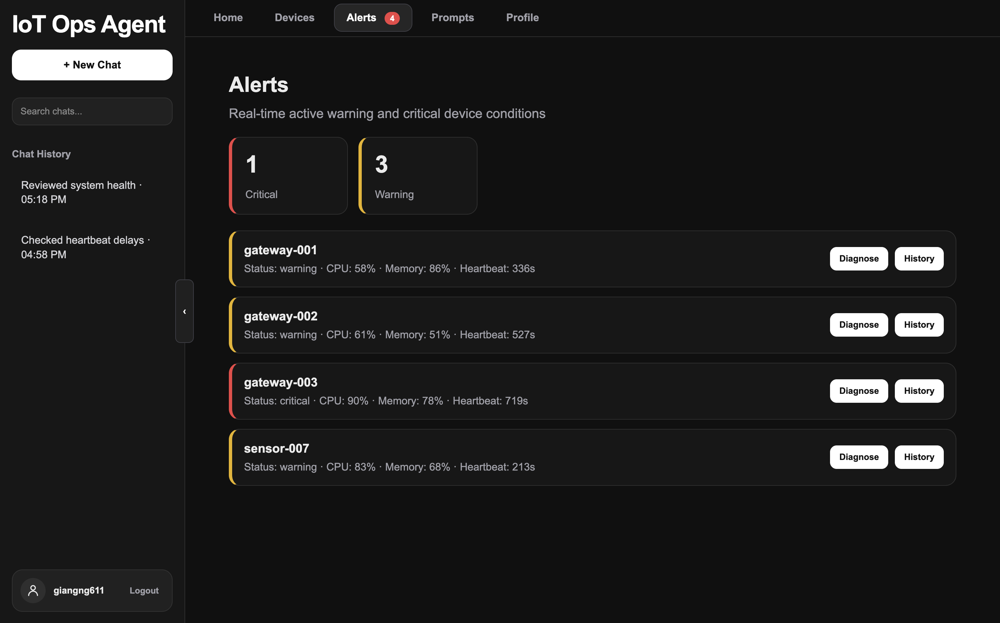
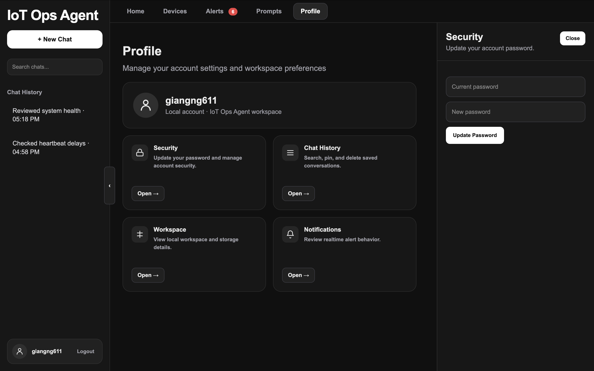
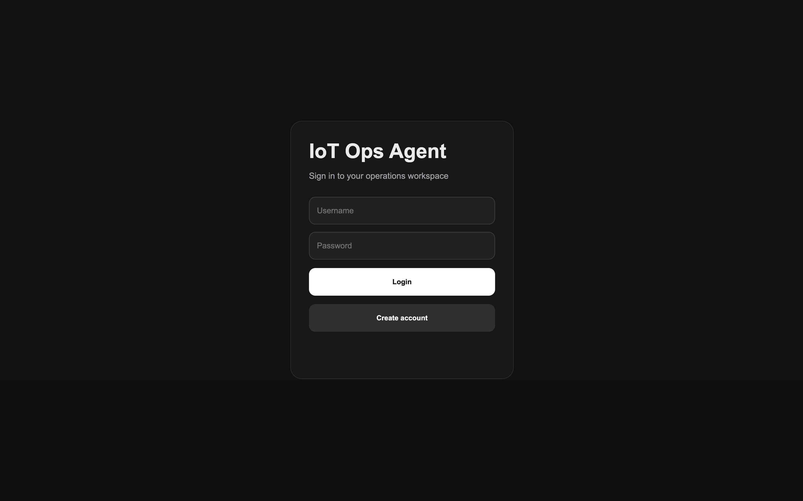
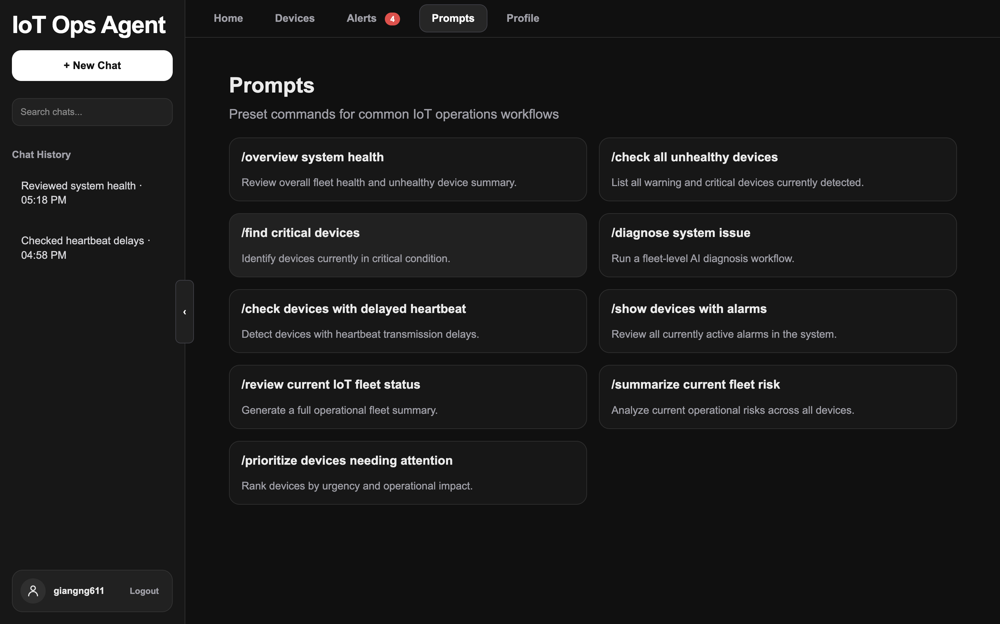

# IoT Ops Agent

AI-powered IoT operations monitoring platform with multi-step reasoning agents, real-time telemetry simulation, streaming diagnostics, and fleet observability.

---

## Overview

IoT Ops Agent is a simulated IoT observability and operations platform designed to monitor, diagnose, and investigate device infrastructure using LLM-powered agents.

The project demonstrates the evolution from:

- **IOA v1** → single-step tool-calling operational assistant
- **IOA v2** → multi-step reasoning agent with iterative diagnostics and streaming reasoning traces

The platform combines:

- Real-time telemetry simulation
- SQLite-backed infrastructure monitoring
- AI-assisted diagnostics
- ReAct-style reasoning workflows
- Live dashboard updates with WebSockets
- Interactive observability dashboards
- Device telemetry analytics
- Local authentication and persistent chat history

---

# Features

## IOA v1 — Single-Step Tool Calling

- Basic OpenAI tool invocation
- One-shot device diagnostics
- Lightweight operational assistant
- Simple system overview queries

---

## IOA v2 — Multi-Step Reasoning Agent

- ReAct-style reasoning loop
- Iterative operational investigations
- Multi-tool diagnostics
- Fleet-wide health analysis
- Alarm correlation
- Streaming reasoning traces
- Context-aware investigations
- System-level and device-level workflows

---

## Real-Time Telemetry Simulation

- 10 continuously simulated IoT devices
- Dynamic telemetry generation
- Periodic CPU / memory / heartbeat updates
- Warning and critical state transitions
- Active alarm generation
- Historical telemetry tracking

---

## Dashboard UI

- ChatGPT-inspired dark interface
- Streaming AI responses
- Live reasoning trace sidebar
- Realtime WebSocket device updates
- Devices management tab
- Fleet analytics charts
- Device telemetry history charts
- Alerts dashboard
- Prompt library
- Searchable and pinnable chat history
- Profile/settings workspace
- Sidebar collapse system
- Interactive right-side drawers

---

## Authentication System

- Local username/password authentication
- Session-based login system
- Persistent user-specific chat history
- Password update workflow
- SQLite-backed user management

---

# Architecture

```text
Simulated IoT Devices
          ↓
Telemetry Simulator
          ↓
SQLite Database
          ↓
Flask Backend API
          ↓
AI Agent Layer
          ↓
Realtime Dashboard UI
```

---

# Tech Stack

## Backend
- Python
- Flask
- Flask-SocketIO
- SQLite
- OpenAI API

## Frontend
- HTML
- CSS
- Vanilla JavaScript
- Chart.js

## AI / Agent Design
- ReAct reasoning architecture
- Tool-calling agents
- Streaming reasoning traces
- Context-aware diagnostics

---

# Example Workflows

## Fleet-Level Investigation

```text
User:
"check devices with delayed heartbeat"

Agent:
1. check_system_overview
2. check_system_alarms
3. Generate final operational diagnosis
```

---

## Device-Level Investigation

```text
User:
"/diagnose gateway-003"

Agent:
1. check_device_status
2. get_recent_logs
3. check_alarm_rules
4. Generate final diagnosis
```

---

## Streaming Reasoning Trace

```text
Iteration 1
Thought:
Need system-wide health overview.

Action:
check_system_overview

Observation:
5 warning devices detected.
```

---

# Real-Time Features

## WebSocket Updates

The dashboard uses Flask-SocketIO for realtime updates including:

- Live device telemetry refresh
- Realtime fleet health updates
- Instant alert propagation
- Dynamic dashboard refreshes

---

## Fleet Analytics

Fleet-level visualizations include:

- Health distribution chart
- Average fleet metrics
- Live operational thresholds
- Alert baseline indicators

---

## Device Analytics

Each device includes:

- Historical telemetry charts
- CPU trend visualization
- Memory utilization tracking
- Heartbeat delay analysis
- Threshold baselines
- Historical operational states

---

# Project Structure

```text
iot-ops-agent/
│
├── app.py
├── simulator.py
├── database.py
├── init_db.py
├── prompts.py
├── tools.py
├── telemetry.db
│
├── agents/
│   ├── week1_agent.py
│   └── week2_agent.py
│
├── static/
│   ├── style.css
│   ├── auth.css
│   ├── script.js
│   └── auth.js
│
├── templates/
│   ├── index.html
│   └── login.html
│
├── screenshots/
│   ├── dashboard.png
│   ├── reasoning-trace.png
│   ├── devices-tab.png
│   ├── alerts-tab.png
│   ├── telemetry-history.png
│   ├── profile-tab.png
│   ├── login-screen.png
│   └── prompts-tab.png
│
├── requirements.txt
└── README.md
```

---

# Installation

## Clone Repository

```bash
git clone https://github.com/giangng611/iot-ops-agent.git
cd iot-ops-agent
```

---

## Install Dependencies

```bash
pip install -r requirements.txt
```

---

## Configure Environment Variables

Create a `.env` file:

```env
OPENAI_API_KEY=your_api_key_here
FLASK_SECRET_KEY=your_secret_key_here
```

---

## Initialize Database

```bash
python3 init_db.py
```

---

## Start Telemetry Simulator

```bash
python3 simulator.py
```

---

## Start Flask Application

```bash
python3 app.py
```

---

## Open Dashboard

```text
http://127.0.0.1:5000
```

---

# Screenshots

## Dashboard Home

Main AI operations workspace with realtime diagnostics and streaming reasoning traces.



---

## Streaming Reasoning Trace

Realtime ReAct-style operational reasoning with live investigation steps.



---

## Devices Tab

Fleet inventory view with realtime device telemetry, diagnostics, and historical analytics.



---

## Device Telemetry History

Interactive historical telemetry visualization with operational baselines.



---

## Alerts Dashboard

Realtime operational alerts and warning management interface.



---

## Profile & Settings

Local account management, workspace settings, and operational preferences.



---

## Authentication Screen

Local login and account authentication workflow.



---

## Prompt Library

Prebuilt operational investigation prompts for faster diagnostics.



---

# Future Improvements

## Infrastructure
- PostgreSQL migration
- Supabase integration
- Docker deployment
- Kubernetes deployment
- Cloud-hosted telemetry ingestion

## AI Features
- AI anomaly prediction
- Predictive maintenance workflows
- Multi-agent orchestration
- Autonomous remediation suggestions
- Root-cause analysis chains

## Product Features
- Multi-user organizations
- RBAC permissions
- Notification delivery system
- Email / Slack alerting
- Exportable operational reports

## Observability
- Advanced analytics
- Historical fleet trends
- Device grouping
- Geographical infrastructure mapping
- Real MQTT ingestion

---

# Author

Giang Nguyen Do  
Computer Science @ University of Georgia