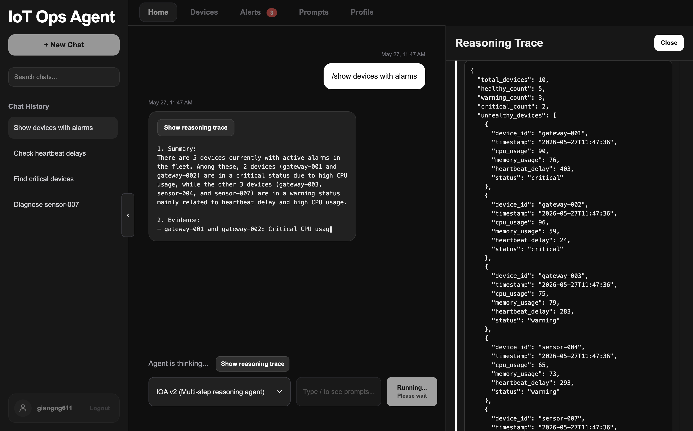

# IoT Ops Agent

AI-powered IoT observability platform with realtime telemetry simulation, operational alert management, AI-assisted diagnostics, and orchestration runtime benchmarking.

---

<p align="center">
  
</p>

<p align="center">
  <strong>Live Demo:</strong><br>
  https://iot-ops-agent.onrender.com
</p>

---

# Overview

IoT Ops Agent is a full-stack simulated IoT operations platform designed to monitor virtual device fleets, stream realtime telemetry, detect operational anomalies, and diagnose infrastructure issues using LLM-powered reasoning agents.

The platform combines:

* realtime telemetry simulation
* operational alert monitoring
* AI-assisted diagnostics
* persistent chat workflows
* user authentication
* prompt workflow management
* telemetry visualization
* orchestration runtime benchmarking

The project currently supports multiple orchestration runtimes:

* **IOA v1 · Custom Python** — single-step tool-calling assistant
* **IOA v2 · Custom Python** — multi-step ReAct-style reasoning runtime
* **IOA v2 · LangChain** — framework-managed orchestration runtime
* **IOA v2 · LangGraph** — graph-based orchestration runtime
* **IOA v2 · n8n** — local webhook-driven workflow runtime

---

# Core Features

* multi-step AI diagnostics
* realtime telemetry monitoring
* operational alert workflows
* telemetry history visualization
* persistent chat history
* prompt workflow management
* access-controlled authentication
* realtime SocketIO updates
* profile and workspace management
* orchestration runtime benchmarking
* streamed reasoning traces
* benchmark execution logging

---

# Architecture

```text
Simulated IoT Devices
          ↓
Telemetry Simulator
          ↓
SQLite Database
          ↓
Flask + SocketIO Backend
          ↓
AI Orchestration Layer
          ↓
Realtime Dashboard UI
```

---

# Tech Stack

## Backend

* Python
* Flask
* Flask-SocketIO
* SQLite
* OpenAI API

## Frontend

* HTML
* CSS
* Vanilla JavaScript
* Chart.js

## AI & Orchestration Systems

* custom ReAct-style reasoning loops
* LangChain orchestration runtime
* LangGraph orchestration runtime
* n8n local workflow runtime
* streamed reasoning traces
* tool-calling agents
* context-aware diagnostics
* operational prompt workflows
* runtime benchmarking pipeline

---

# Runtime Benchmarking

The platform includes a benchmarking system for comparing orchestration runtimes inside the same operational environment.

Current benchmark dimensions include:

* operational accuracy
* telemetry grounding
* reasoning clarity
* runtime observability
* integration complexity
* ecosystem support
* development speed

Benchmark results are automatically logged into CSV execution records for evaluation and aggregation.

Phase 1 currently compares Custom Python, LangChain, LangGraph, and n8n across five shared operational prompts.

See the [Benchmarking Guide](docs/BENCHMARKING.md) for details.

---

# Quick Start

## 1. Clone Repository

```bash
git clone https://github.com/giangng611/iot-ops-agent.git
cd iot-ops-agent
```

---

## 2. Install Dependencies

```bash
pip install -r requirements.txt
```

---

## 3. Configure Environment Variables

Create a `.env` file:

```env
OPENAI_API_KEY=your_openai_api_key
FLASK_SECRET_KEY=your_secret_key
ACCESS_CODE=please_contact_project_owner
N8N_WEBHOOK_URL=http://localhost:5678/webhook/iot-ops-eval
```

---

## 4. Initialize Database

```bash
python3 init_db.py
```

---

## 5. Start Telemetry Simulator

```bash
python3 simulator.py
```

---

## 6. Start Flask Application

```bash
python3 app.py
```

Open the application:

```text
http://127.0.0.1:5001
```

---

# Deployment Notes

The application is currently structured for Render deployment.

Environment variables should be configured through the deployment provider instead of committing secrets directly into the repository.

`N8N_WEBHOOK_URL` is optional and only required when testing the `IOA v2 · n8n` runtime mode in the UI.

---

# Documentation

* [Setup Guide](docs/SETUP.md)
* [Architecture](docs/ARCHITECTURE.md)
* [Features](docs/FEATURES.md)
* [Benchmarking](docs/BENCHMARKING.md)
* [n8n UI Integration](docs/N8N_UI_INTEGRATION.md)
* [Roadmap](docs/ROADMAP.md)

---

# Future Improvements

* PostgreSQL migration
* RBAC and admin dashboards
* persistent cloud storage
* external notification integrations
* production-grade authentication
* local model runtime support
* advanced orchestration evaluation
* workflow automation runtimes

---

# License

MIT License © 2026 Giang Nguyen Do

---

# Author

Giang Nguyen Do

Computer Science @ University of Georgia
