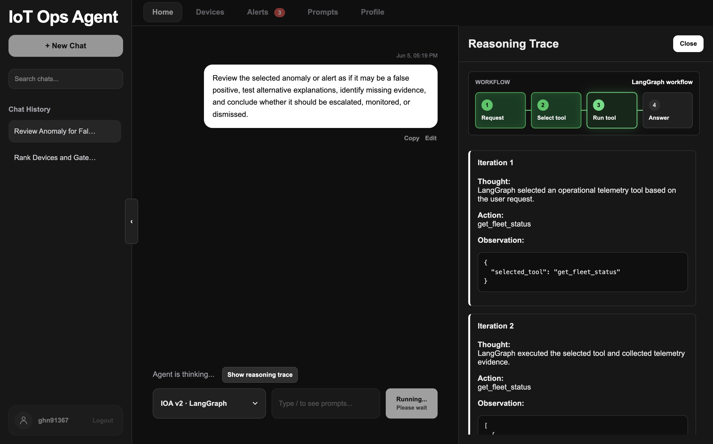

# IoT Ops Agent

AI-powered IoT observability platform with realtime telemetry simulation, operational alert management, AI-assisted diagnostics, and orchestration runtime benchmarking.

---

<p align="center">
  
</p>

<p align="center">
  <strong>Live Demo:</strong><br>
  https://iot-ops-agent.onrender.com
</p>

---

# Overview

IoT Ops Agent is a full-stack simulated IoT operations platform designed to monitor virtual device fleets, stream realtime telemetry, detect operational anomalies, and diagnose infrastructure issues using LLM-powered reasoning agents.

The platform combines:

* realtime telemetry simulation
* operational alert monitoring
* AI-assisted diagnostics
* persistent chat workflows
* user authentication
* prompt workflow management
* telemetry visualization
* orchestration runtime benchmarking

The project currently supports multiple orchestration runtimes:

* **IOA v1 · Custom Python** — single-step tool-calling assistant
* **IOA v2 · Custom Python** — multi-step ReAct-style reasoning runtime
* **IOA v2 · LangChain** — framework-managed orchestration runtime
* **IOA v2 · LangGraph** — graph-based orchestration runtime
* **IOA v2 · n8n** — local webhook-driven workflow runtime
* **IOA v2 · Dify** — self-hosted app API-driven chatflow runtime

---

# Core Features

* multi-step AI diagnostics
* realtime telemetry monitoring
* operational alert workflows
* telemetry history visualization
* persistent chat history
* prompt workflow management
* access-controlled authentication
* realtime SocketIO updates
* profile and workspace management
* orchestration runtime benchmarking
* streamed reasoning traces
* benchmark execution logging

---

# Architecture

```text
Simulated IoT Devices
          ↓
Telemetry Simulator
          ↓
MongoDB Telemetry Store
          ↓
Supabase/Postgres App Data Store
          ↓
SQLite Legacy/Fallback Store
          ↓
Flask + SocketIO Backend
          ↓
AI Orchestration Layer
          ↓
Realtime Dashboard UI
```

---

# Tech Stack

## Backend

* Python
* Flask
* Flask-SocketIO
* MongoDB
* Supabase/Postgres
* SQLite legacy/fallback
* OpenAI API

## Frontend

* HTML
* CSS
* Vanilla JavaScript
* Chart.js

## AI & Orchestration Systems

* custom ReAct-style reasoning loops
* LangChain orchestration runtime
* LangGraph orchestration runtime
* n8n local workflow runtime
* Dify self-hosted chatflow runtime
* streamed reasoning traces
* tool-calling agents
* context-aware diagnostics
* operational prompt workflows
* runtime benchmarking pipeline

---

# Runtime Benchmarking

The platform includes a benchmarking system for comparing orchestration runtimes inside the same operational environment.

Current benchmark dimensions include:

* blind AI-judged answer quality against frozen operational context
* factual correctness and telemetry grounding
* task completion, actionability, and source discipline
* measured latency, execution success, and trace visibility
* separately documented engineering and ecosystem tradeoffs

Raw executions and AI-judged results are stored separately so provisional or
manually assigned scores are not presented as measured evidence.

The current benchmark compares Custom Python, LangChain, LangGraph, n8n, and Dify across shared operational prompts, including custom prompt workflows created from the Prompts tab.

See the [Benchmarking Guide](docs/BENCHMARKING.md) for details.

---

# Quick Start

## 1. Clone Repository

```bash
git clone https://github.com/giangng611/iot-ops-agent.git
cd iot-ops-agent
```

---

## 2. Create a Python Environment

Windows PowerShell:

```powershell
py -3.12 -m venv .venv
.\.venv\Scripts\Activate.ps1
python -m pip install -r requirements.txt
```

macOS or Linux:

```bash
python3 -m venv .venv
source .venv/bin/activate
python -m pip install -r requirements.txt
```

Python 3.11 or 3.12 is recommended. After the environment is activated, use
`python` for the remaining commands on every operating system.

---

## 3. Configure Environment Variables

Create a `.env` file:

```env
OPENAI_API_KEY=your_openai_api_key
FLASK_SECRET_KEY=your_secret_key
SOCKETIO_CORS_ORIGINS=
MAX_DIAGNOSE_MESSAGE_CHARS=2000
DIAGNOSE_RATE_LIMIT_REQUESTS=10
DIAGNOSE_RATE_LIMIT_WINDOW_SECONDS=60
ENABLE_EMBEDDED_TELEMETRY=true
TELEMETRY_BROADCAST_INTERVAL_SECONDS=300
ACCESS_CODE=please_contact_project_owner
N8N_WEBHOOK_URL=http://localhost:5678/webhook/iot-ops-eval
DIFY_API_URL=http://localhost/v1/chat-messages
DIFY_API_KEY=your_dify_app_api_key
DIFY_USER=iot-ops-agent-ui
PUBLIC_BASE_URL=https://iot-ops-agent.onrender.com
TELEGRAM_BOT_TOKEN=your_telegram_bot_token
TELEGRAM_WEBHOOK_SECRET=your_random_webhook_secret
TELEGRAM_ALLOWED_USER_IDS=
TELEGRAM_HISTORY_USER_ID=
```

---

## 4. Initialize Database

```bash
python init_db.py
```

---

## 5. Start Telemetry Simulator

```bash
python simulator.py
```

---

## 6. Start Flask Application

```bash
python app.py
```

Open the application:

```text
http://127.0.0.1:5001
```

---

# Deployment Notes

The application is currently structured for Render deployment.

Environment variables should be configured through the deployment provider instead of committing secrets directly into the repository.

`N8N_WEBHOOK_URL` is optional and only required when testing the `IOA v2 · n8n` runtime mode in the UI.

`DIFY_API_URL`, `DIFY_API_KEY`, and `DIFY_USER` are optional and only required when testing the `IOA v2 · Dify` runtime mode in the UI. For the local self-hosted Dify setup, `DIFY_API_URL` is usually `http://localhost/v1/chat-messages`.

---

# Documentation

* [Setup Guide](docs/SETUP.md)
* [Architecture](docs/ARCHITECTURE.md)
* [Features](docs/FEATURES.md)
* [Benchmarking](docs/BENCHMARKING.md)
* [Company Agent Scope](docs/COMPANY_AGENT_SCOPE.md)
* [n8n UI Integration](docs/N8N_UI_INTEGRATION.md)
* [Dify UI Integration](docs/DIFY_UI_INTEGRATION.md)
* [Telegram PoC](docs/TELEGRAM_POC.md)
* [Company DB Discovery](docs/COMPANY_DB_DISCOVERY.md)
* [Roadmap](docs/ROADMAP.md)

---

# Tests

Run the focused backend safety checks:

```bash
python -m unittest tests/test_security_and_realtime.py
```

The suite covers protected API access, chat ownership, diagnosis request
limits, storage status payloads, Telegram webhook behavior, and embedded
realtime telemetry health.

Storage checks:

```bash
python scripts/check_app_storage_status.py
python scripts/verify_supabase_app_data_migration.py
```

---

# Future Improvements

* Row Level Security policy design for any future browser-side Supabase access
* RBAC and admin dashboards
* external notification integrations
* production-grade authentication
* local model runtime support
* advanced orchestration evaluation
* workflow automation runtimes

---

# License

MIT License © 2026 Giang Nguyen Do

---

# Author

Giang Nguyen Do

Computer Science @ University of Georgia
