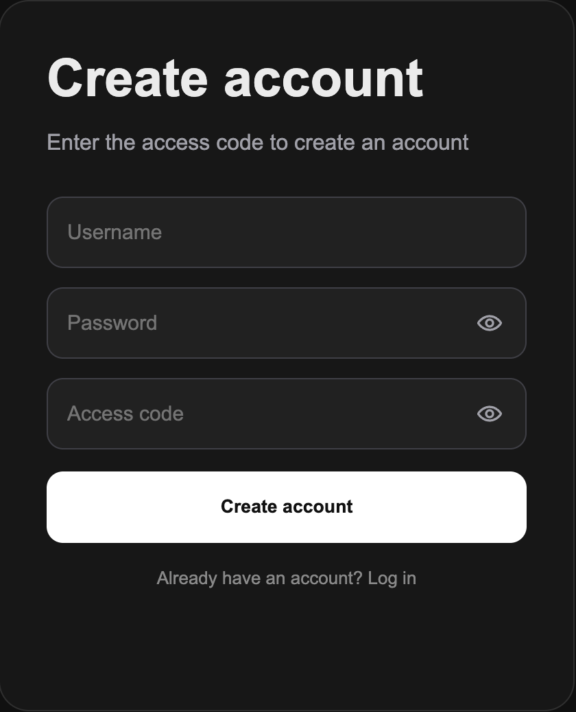

# Features

IoT Ops Agent combines realtime IoT monitoring, AI-assisted diagnostics, persistent chat workflows, operational alert handling, prompt management, and user workspace controls into a single platform.

---

## Realtime AI Operations Workspace

The home workspace provides an AI-powered operations console for interacting with the simulated IoT fleet.

Features include:

- IOA v1 single-step diagnosis
- IOA v2 multi-step reasoning agent
- LangChain runtime mode
- LangGraph runtime mode
- n8n local workflow runtime mode
- streaming responses
- live typing effects
- persistent reasoning traces
- timestamped conversations
- saved chat history
- AI-generated chat titles
- pinned and searchable conversations
- busy-state protection during agent execution

  

---

## ReAct-Style Reasoning Trace

IOA v2 streams intermediate reasoning steps using a ReAct-style workflow.

The reasoning drawer displays:

- thought generation
- tool actions
- observations
- streamed JSON outputs
- final answer generation
- saved reasoning traces for previous assistant messages
- live drawer behavior while the agent is running

  

---

## Device Fleet Monitoring

The Devices tab provides realtime fleet visibility for the simulated IoT environment.

Features include:

- live telemetry updates
- device search
- status filtering
- sorting by priority, CPU, memory, heartbeat delay, and timestamp
- fleet health visualization
- average telemetry charts
- direct device diagnosis
- telemetry history inspection
- realtime SocketIO updates

  

---

## Historical Telemetry Analysis

Each device includes a telemetry history modal for operational investigation.

Charts display:

- CPU usage trends
- memory usage trends
- heartbeat delay trends
- recent telemetry timestamps
- operational warning thresholds
- device-level historical context for diagnosis

  

---

## Operational Alert Center

The Alerts tab provides realtime operational incident management.

Features include:

- critical and warning alert tracking
- alert acknowledgment workflow
- alert resolution workflow
- alert state badges
- acknowledge/resolve timestamps
- active incident monitoring
- persistent visibility for unresolved device conditions
- direct diagnosis actions
- device history access from alerts
- scrollable alert list with fixed header and summary cards

  

---

## Prompt Workflow System

The Prompts tab acts as a reusable operational workflow catalog.

Features include:

- default system prompts
- custom user prompts
- create, edit, and delete prompt workflows
- delete confirmation modal
- category filtering
- default/custom type filtering
- prompt search
- slash-command integration
- synced prompt catalog between the Prompts tab and chat input
- persistent prompt storage

  

---

## Profile & Workspace Management

The Profile tab centralizes account, usage, session, and workspace controls.

Features include:

- account overview
- username update workflow
- password update workflow with confirmation modal
- delete account workflow with password confirmation
- logout confirmation
- usage statistics
- saved conversation metrics
- message count metrics
- custom prompt count
- monitored device count
- session activity drawer
- realtime stream status indicator
- runtime environment indicator
- notification status overview
- profile side drawer for account actions

  

---

## Authentication & Access Control

The platform includes a complete authentication and access-control flow.

Features include:

- login
- access-code protected registration
- demo access control
- logout confirmation
- session persistence
- protected routes
- password hashing
- administrator-managed account access messaging

  

  

---

## Realtime Telemetry Simulation

The backend simulates an operational IoT fleet with continuously updating telemetry.

Each device tracks:

- CPU usage
- memory usage
- heartbeat delay
- operational status
- telemetry timestamps
- log messages
- alarm names
- alarm severity

The simulation powers:

- fleet dashboards
- alert generation
- AI diagnosis
- telemetry charts
- operational reasoning workflows
- realtime frontend updates

---

## Runtime Benchmarking

The project includes a benchmark workflow for comparing orchestration runtimes against the same IoT telemetry environment and prompt set.

Currently evaluated runtimes include:

- IOA v2 · Custom Python
- IOA v2 · LangChain
- IOA v2 · LangGraph
- IOA v2 · n8n

Benchmark dimensions include:

- operational accuracy
- telemetry/tool grounding
- reasoning clarity
- runtime observability
- development complexity
- integration speed
- ecosystem maturity
- maintainability
- latency

Phase 1 benchmark results are stored in CSV format and summarized in the benchmarking documentation.

---

## Deployment-Ready Demo Architecture

The project is structured as a deployable full-stack demo application.

Current deployment architecture includes:

- Flask backend
- Flask-SocketIO realtime communication
- SQLite demo database
- OpenAI API integration
- Render deployment support
- environment-variable based secrets
- seeded telemetry data on startup
- protected demo signup through access code

Future production improvements may include:

- PostgreSQL or Supabase migration
- persistent cloud storage
- stronger rate limiting
- admin dashboard
- production-grade authentication
- external alert notification channels
