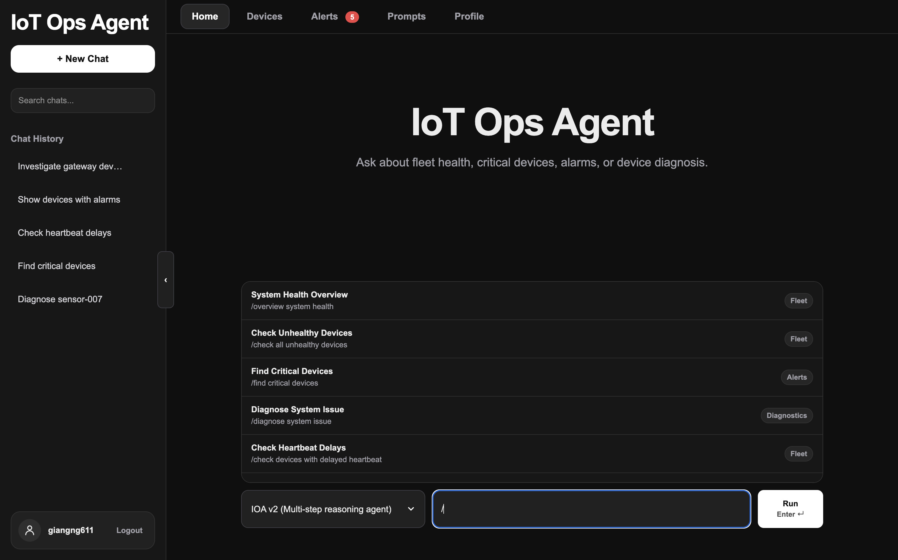
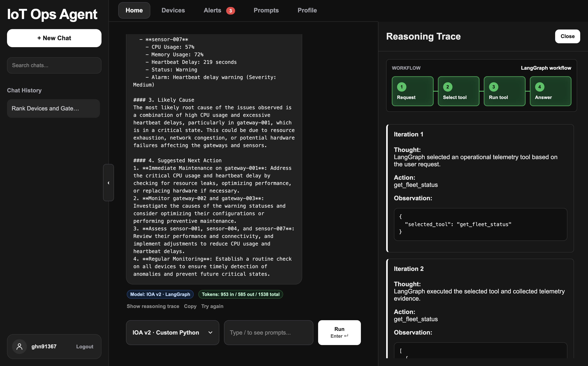
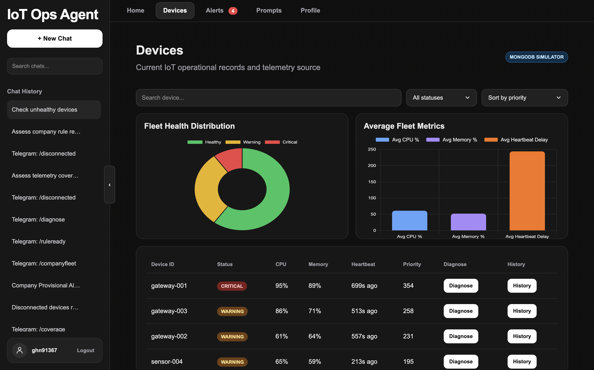
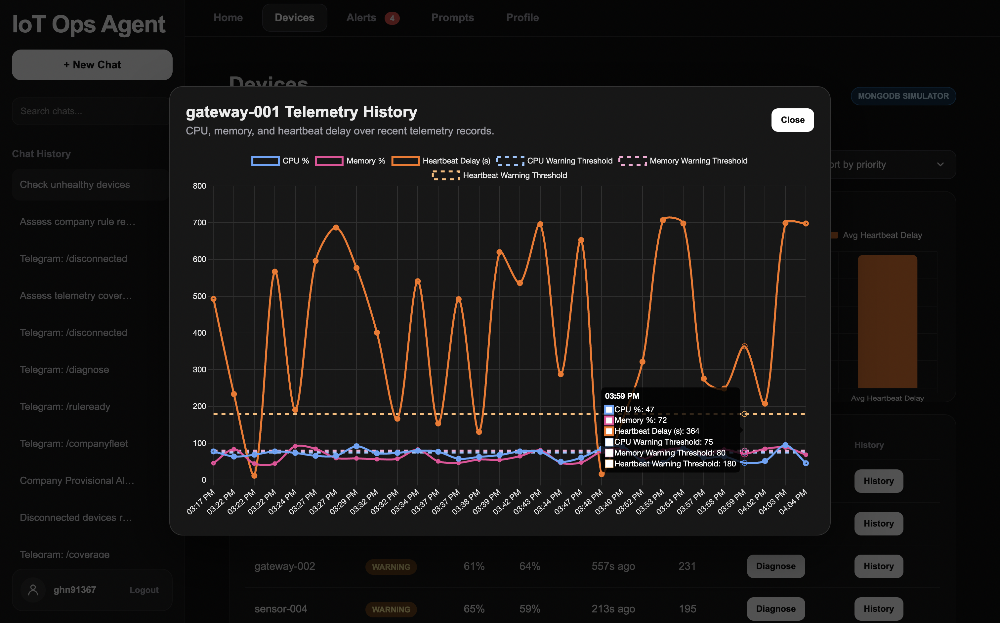
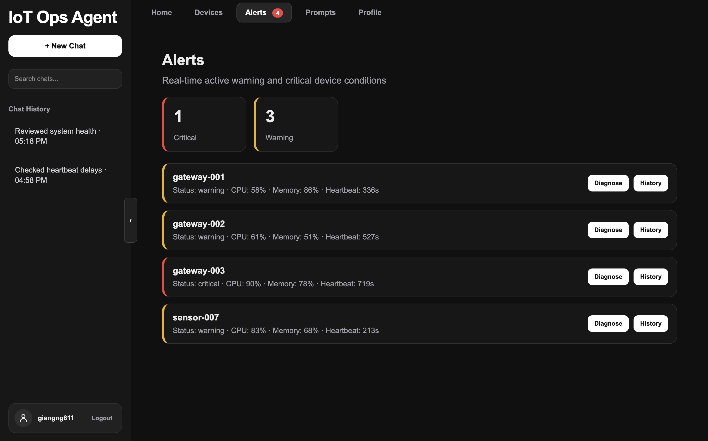
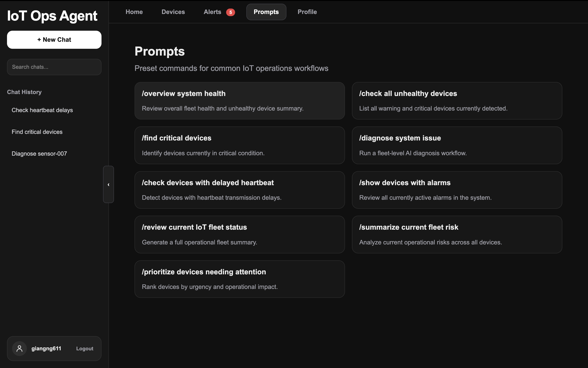
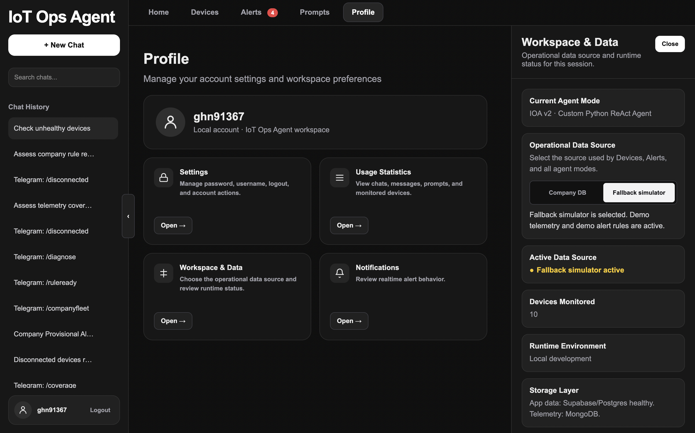
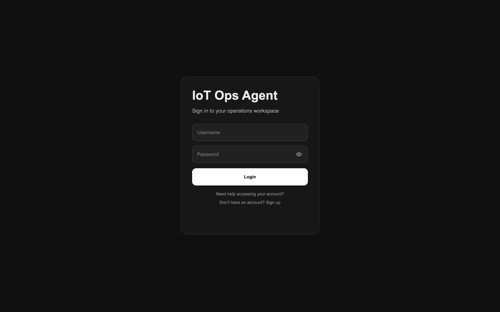
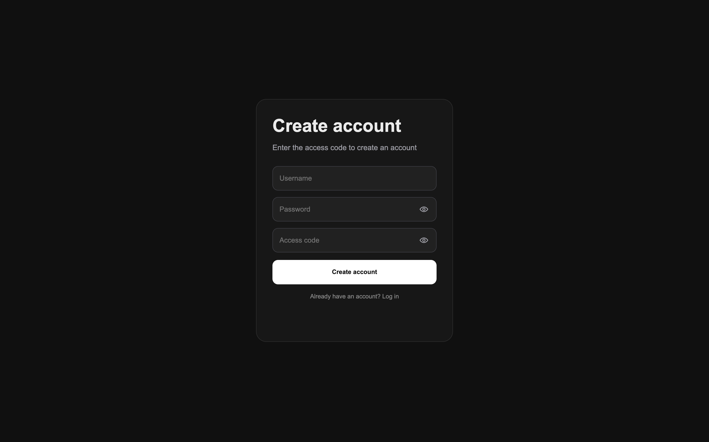

# Features

IoT Ops Agent combines realtime IoT monitoring, AI-assisted diagnostics,
persistent chat workflows, operational alert handling, prompt management,
Telegram interaction, and source-aware workflow routing into a single platform.

---

## Realtime AI Operations Workspace

The home workspace provides an AI-powered operations console for interacting
with either simulator telemetry or the read-only Company DB source.

Features include:

- IOA v3 Ops Graph policy/runtime mode
- IOA v1 single-step diagnosis
- IOA v2 multi-step reasoning agent
- LangChain runtime mode
- LangGraph runtime mode
- n8n local workflow runtime mode
- Dify self-hosted chatflow runtime mode
- streaming responses
- live typing effects
- persistent reasoning traces
- timestamped conversations
- saved chat history
- AI-generated chat titles
- pinned and searchable conversations
- busy-state protection during agent execution
- explicit source selection and visible simulator fallback
- Company DB mode with explicit simulator fallback when evidence is unavailable

  

---

## IOA v3 Ops Graph

IOA v3 is the controlled operational workflow runtime for company-style
incident triage.

Features include:

- LangGraph policy gates before tool execution
- hybrid semantic planner with deterministic taxonomy fallback
- MCP tools for Company DB, Loki, Grafana, and Prometheus evidence
- allowlisted operational tool families and params
- multi-workflow answers for mixed Company DB, log, and metric requests
- KPI rule attachment from `config/grafana_kpi_rules.json`
- visible planner decisions, authorization decisions, tool calls, and bounded
  evidence in the reasoning trace

The Grafana/Prometheus path runs through MCP. Human Grafana dashboard URLs are
used for mapping and review, not direct tool calls.

---

## ReAct-Style Reasoning Trace

IOA v2 streams intermediate reasoning steps using a ReAct-style workflow. IOA
v3 extends the same trace surface with planner, authorization, MCP tool
execution, and KPI rule-attachment steps.

The reasoning drawer displays:

- thought generation
- tool actions
- observations
- streamed JSON outputs
- final answer generation
- saved reasoning traces for previous assistant messages
- live drawer behavior while the agent is running

  

---

## Device Fleet Monitoring

The Devices tab supports simulator and Company DB views.

Features include:

- live telemetry updates
- device search
- status filtering
- sorting by priority, CPU, memory, heartbeat delay, and timestamp
- fleet health visualization
- average telemetry charts
- direct device diagnosis
- telemetry history inspection
- realtime SocketIO updates
- Company DB connection filtering and sorting
- company inventory, latest telemetry, history, and provisional rule context

  

---

## Historical Telemetry Analysis

Each device includes a telemetry history modal for operational investigation.

Charts display:

- CPU usage trends
- memory usage trends
- heartbeat delay trends
- recent telemetry timestamps
- operational warning thresholds
- device-level historical context for diagnosis

  

---

## Operational Alert Center

The Alerts tab provides realtime operational incident management.

Features include:

- critical and warning alert tracking
- alert acknowledgment workflow
- alert resolution workflow
- alert state badges
- acknowledge/resolve timestamps
- active incident monitoring
- persistent visibility for unresolved device conditions
- direct diagnosis actions
- device history access from alerts
- scrollable alert list with fixed header and summary cards

  

---

## Prompt Workflow System

The Prompts tab acts as a reusable operational workflow catalog.

Features include:

- default system prompts
- custom user prompts
- create, edit, and delete prompt workflows
- delete confirmation modal
- category filtering
- default/custom type filtering
- prompt search
- slash-command integration
- synced prompt catalog between the Prompts tab and chat input
- persistent prompt storage
- custom operational workflow commands for benchmark and runtime testing

  

---

## Profile & Workspace Management

The Profile tab centralizes account, usage, session, and workspace controls.

Features include:

- account overview
- username update workflow
- password update workflow with confirmation modal
- delete account workflow with password confirmation
- logout confirmation
- usage statistics
- saved conversation metrics
- message count metrics
- custom prompt count
- monitored device count
- session activity drawer
- realtime stream status indicator
- runtime environment indicator
- notification status overview
- profile side drawer for account actions

  

---

## Authentication & Access Control

The platform includes a complete authentication and access-control flow.

Features include:

- login
- access-code protected registration
- demo access control
- logout confirmation
- session persistence
- protected routes
- password hashing
- administrator-managed account access messaging

  

  

---

## Realtime Telemetry Simulation

The backend simulates an operational IoT fleet with continuously updating telemetry.

Each device tracks:

- CPU usage
- memory usage
- heartbeat delay
- operational status
- telemetry timestamps
- log messages
- alarm names
- alarm severity

The simulation powers:

- fleet dashboards
- alert generation
- AI diagnosis
- telemetry charts
- operational reasoning workflows
- realtime frontend updates

---

## Runtime Benchmarking

The project includes a benchmark workflow for comparing orchestration runtimes
against the same IoT telemetry environment and prompt set.

Currently evaluated runtimes include:

- IOA v1 · Custom Python
- IOA v2 · Custom Python
- IOA v2 · LangChain
- IOA v2 · LangGraph
- IOA v2 · n8n
- IOA v2 · Dify

The current benchmark stores raw answers, reference context, trace evidence,
latency, status, and token usage when available. A separate blind AI judge
scores factual correctness, evidence grounding, task completion,
actionability, and source discipline. Engineering tradeoffs are evaluated
separately.

Assistant responses display a token usage badge when the selected runtime returns model usage metadata. Runtime traces also include workflow maps so Custom Python, LangChain, LangGraph, n8n, and Dify execution paths can be compared visually.

Dify is available as a self-hosted chatflow runtime. Flask packages the
selected operational context for Dify, normalizes its response, and surfaces
app-level reasoning steps when the Chatflow returns them.

---

## Deployment-Ready Architecture

The project is structured as a deployable full-stack application.

Current deployment architecture includes Flask, Flask-SocketIO, OpenAI,
Supabase/Postgres app data, MCP-backed operational evidence, optional MongoDB
simulator telemetry, and environment-based secrets.

Company MongoDB, Loki, Grafana, and Prometheus access is network-dependent and
is exercised through the MCP server.
